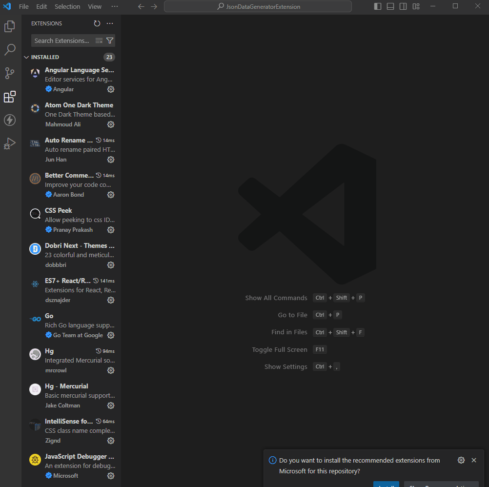

# Random JSON Generator

## Features

This extension generates random JSON data in a temporary file for usage. Here's how to use it:

1. Install the extension.
2. Press `Ctrl + Shift + P` to open the command palette.
3. Search for "Json Data Generator" and select it.

## Requirements

There are no additional requirements or dependencies for this extension.

## Extension Settings

This extension doesn't contribute any specific settings.

## Known Issues

Currently, there are no known issues. Please report any you encounter!

## Release Notes

### 0.0.1

Initial release of the Random JSON Generator extension.

### 0.0.2

- Minor coding changes.
- Improved stability and performance.

**Enjoy!**
